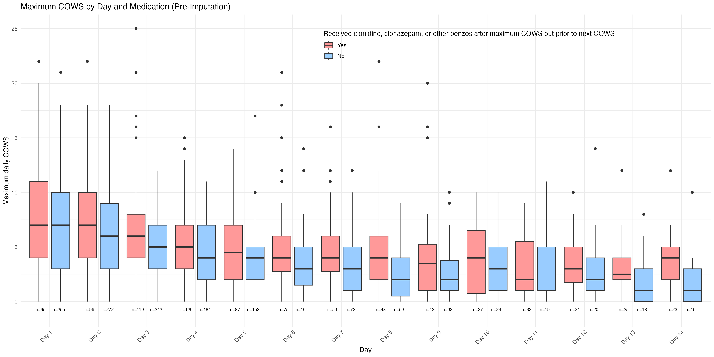

```{r setup, include=FALSE}
knitr::opts_chunk$set(echo = TRUE)
library(tidyverse)
library(knitr)
```

### Post-Consent Medication Table COWS &ge; 8
```{r, echo = FALSE}
read.csv(here::here("results/ctn97_medication_tbl_8.csv")) |>
  select(-X, -clonidine_only, -clonazepam_only) |>
  kable()
```

### Post-Consent Medication Table COWS &ge; 5
```{r, echo = FALSE}
read.csv(here::here("results/ctn97_medication_tbl_5.csv")) |>
  select(-X, -clonidine_only, -clonazepam_only) |>
  kable()
```

### Post-Consent Medication Table COWS > 3
```{r, echo = FALSE}
read.csv(here::here("results/ctn97_medication_tbl_3.csv")) |>
  select(-X, -clonidine_only, -clonazepam_only) |>
  kable()
```

### Boxplots of Maximum COWS


Notes:
- Hydrocodone: `mediator_opioid_hydrocodone_rx`
- Oxycodone: `mediator_opioid_oxycodone_rx`
* Day 1 is day of signed consent
* Only looking at treatments occurring after maximum COWS but prior to the next COWS
* Clonidine &ge; 0.1 mg, clonazepam &ge; 1 mg
* Missing COWS are not included in sample size counts

