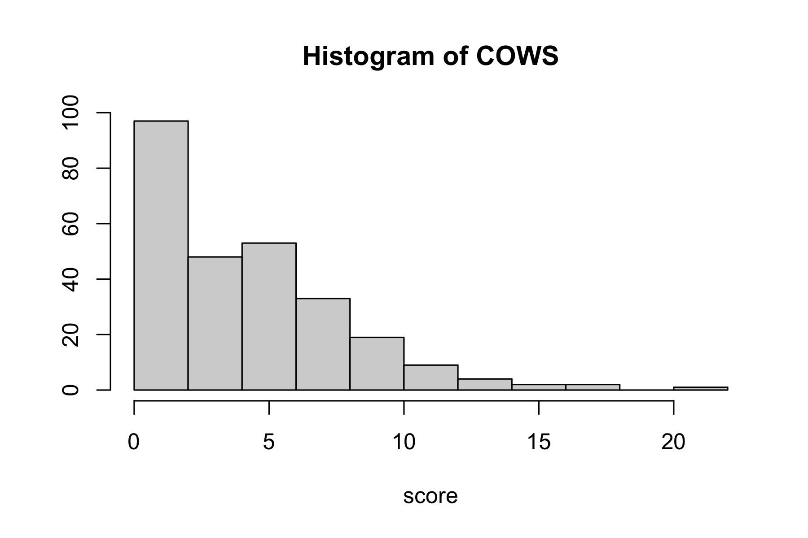
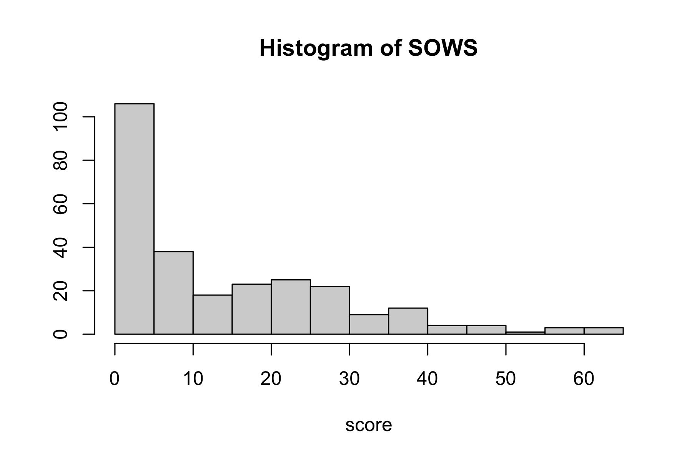
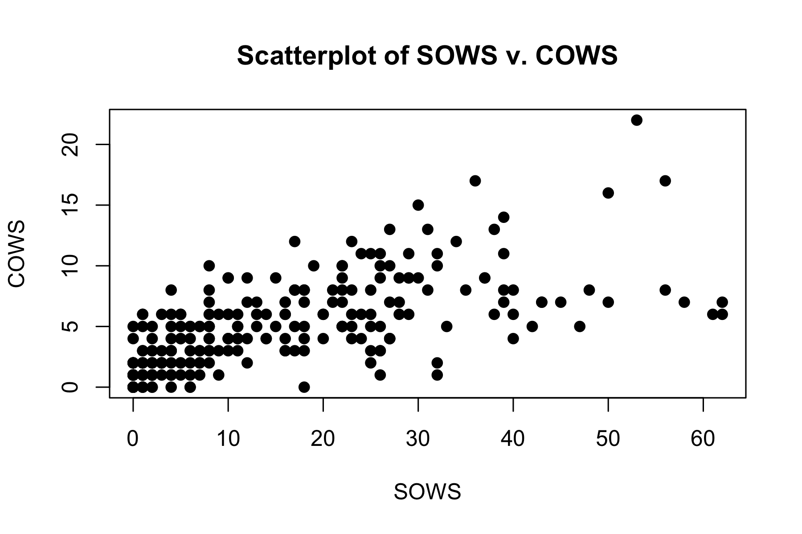

COWS and SOWS
================

## Descriptive Plots

- Keeping SOWS and COWS that are within 15 minutes of each other (n =
  268 within 15 minutes, n = 51 at the same time)

<!-- --><!-- --><!-- -->

## Model

- LASSO model with COWS as a function of SOWS + baseline covariates
  (same as primary paper) + medication (total clonidine dose in
  preceding 24 hours, total clonazepam dose in preceding 24 hours, total
  benzodiazepine dose on previous day) + other variables (days from
  admission, days between admission and consent, time between COWS and
  SOWS scores, indicator for COWS being measured prior to SOWS, etc.)
  - Interactions between SOWS and each variable

#### Use 1SE lambda

|                                  | Coefficient |
|:---------------------------------|------------:|
| (Intercept)                      |   2.7329773 |
| sows_score                       |   0.1019413 |
| age                              |  -0.0018520 |
| sows_score:DEOTHER               |   0.0148101 |
| sows_score:cannabis_use_disorder |   0.0203933 |
| sows_score:anxiety               |   0.0396782 |

#### Use min lambda

|                                           | Coefficient |
|:------------------------------------------|------------:|
| (Intercept)                               |   4.2489957 |
| sows_score                                |   0.1328301 |
| days_from_admission                       |  -0.0423524 |
| age                                       |  -0.0487705 |
| is_hispanic                               |  -0.2204360 |
| amphetamine_use_disorder                  |   0.5224093 |
| sedative_use_disorder                     |  -0.7620519 |
| anxiety                                   |   0.0748519 |
| sows_score:time_diff_hours                |   0.0077102 |
| sows_score:days_from_admission            |   0.0019656 |
| sows_score:days_from_admission_to_consent |   0.0034661 |
| sows_score:is_hispanic                    |  -0.0017574 |
| sows_score:DEBLACK                        |   0.0062744 |
| sows_score:DEOTHER                        |   0.0350671 |
| sows_score:cannabis_use_disorder          |   0.0139391 |
| sows_score:cocaine_use_disorder           |   0.0218883 |
| sows_score:sedative_use_disorder          |  -0.0097517 |
| sows_score:injection_opioid_use           |   0.0006652 |
| sows_score:anxiety                        |   0.0511444 |
| sows_score:bipolar                        |  -0.0066940 |
| sows_score:sum_clonidine_24hrs            |  -0.0405765 |
| sows_score:sum_clonazepam_24hrs           |  -0.0031173 |
| sows_score:sum_benzo_previous_day         |  -0.0011214 |
