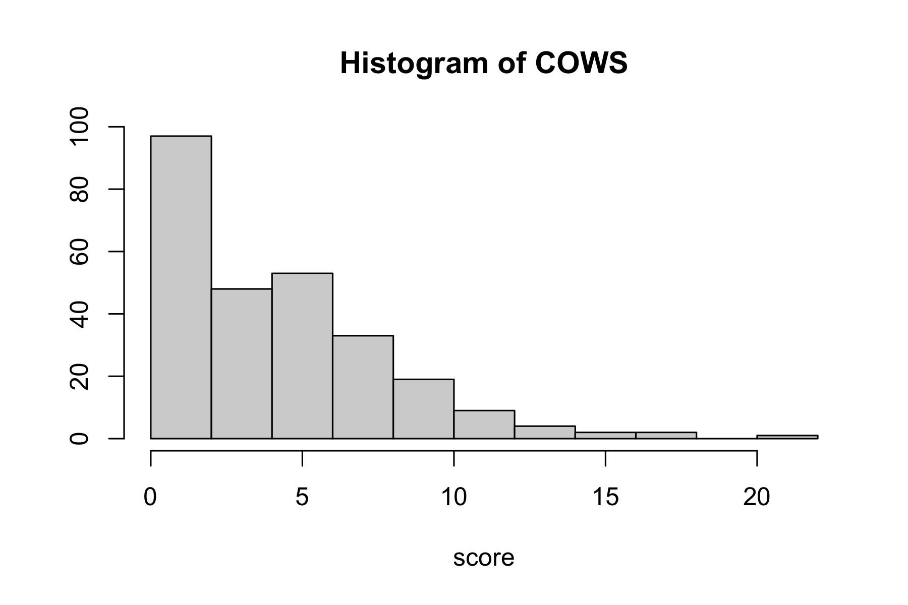
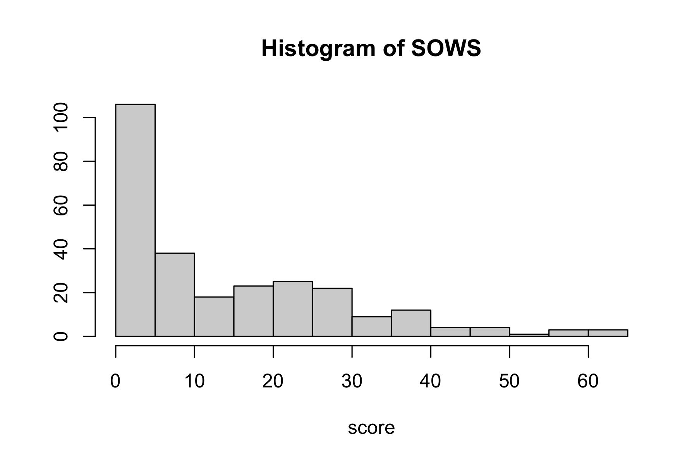
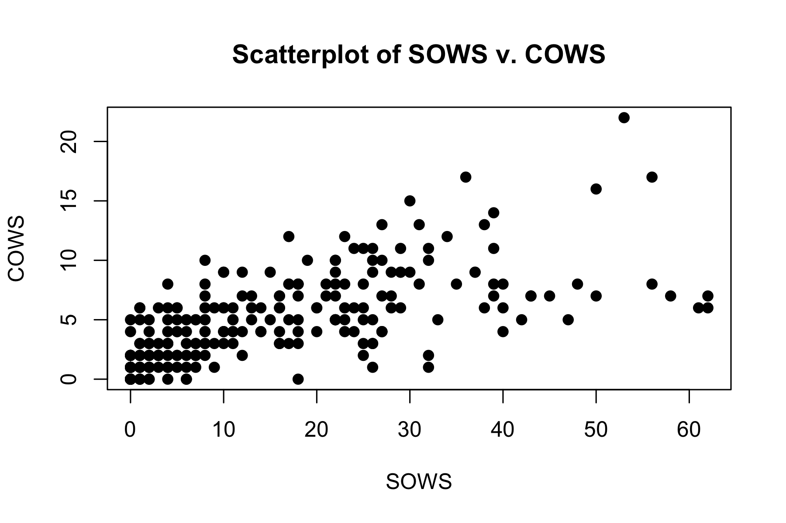

COWS and SOWS
================

## Descriptive Plots

- Keeping SOWS and COWS that are within 15 minutes of each other (n =
  268 within 15 minutes, n= 51 at the same time)

<!-- --><!-- --><!-- -->

## Model

- LASSO model with COWS as a function of SOWS + baseline covariates
  (same as primary paper) + medication (total clonidine dose in
  preceding 24 hours, total clonazepam dose in preceding 24 hours, total
  benzodiazepine dose on previous day) + other variables (days from
  admission, days between admission and consent, time between COWS and
  SOWS scores, indicator for COWS being measured prior to SOWS, etc.)
  - Interactions between SOWS and each variable
  - Use 1SE lambda

|                                  | Coefficient |
|:---------------------------------|------------:|
| (Intercept)                      |   2.7329773 |
| sows_score                       |   0.1019413 |
| age                              |  -0.0018520 |
| sows_score:DEOTHER               |   0.0148101 |
| sows_score:cannabis_use_disorder |   0.0203933 |
| sows_score:anxiety               |   0.0396782 |
